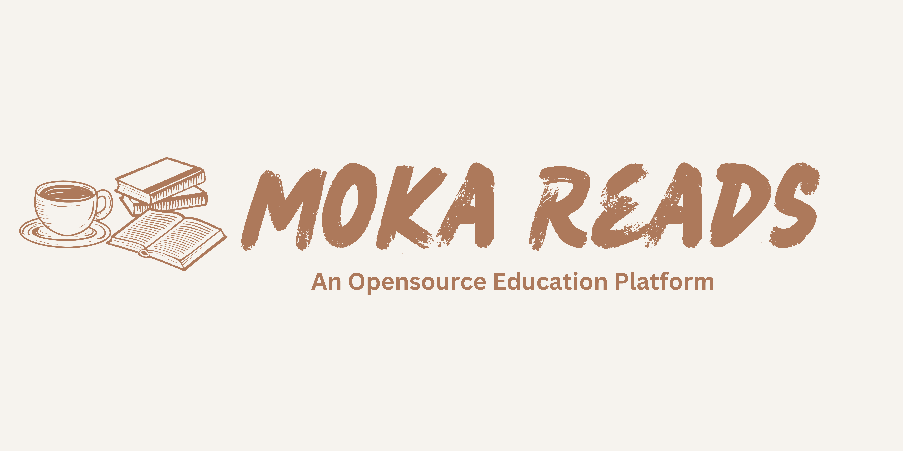

# MoKa Reads Logos 

 >  
<a property="dct:title" rel="cc:attributionURL" href="https://github.com/Moka-Reads/Logos">MoKa Reads Logos</a> by Mustafif Khan is licensed under <a href="http://creativecommons.org/licenses/by-sa/4.0/?ref=chooser-v1" target="_blank" rel="license noopener noreferrer" style="display:inline-block;">Attribution-ShareAlike 4.0 International</a>
 

## MoKa Reads Banner (6912 x 3456)

## MoKa Reads Square (1080 x 1080)

